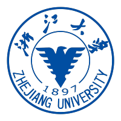
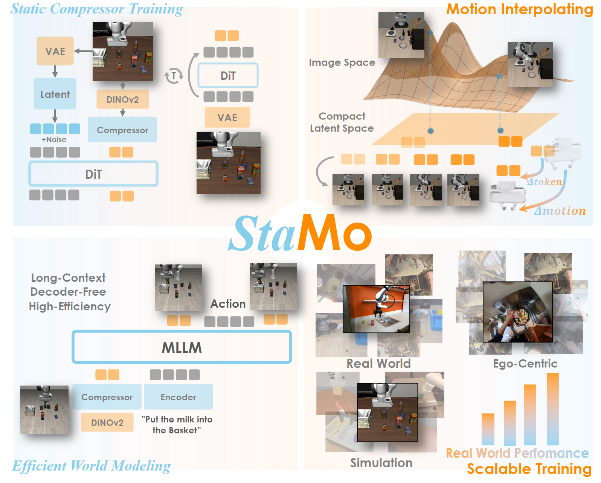

<html> 
<head>
    
</head>
<body>
<h1 class="main-heading">👋 Hello, World! Welcome to My Space 🚀</h1>

last update: 2026.05

</body>
</html>

我是一名来自[西北工业大学](https://www.nwpu.edu.cn/){:target="_blank"}（985/211/双一流）计算机学院计算机科学与技术专业的大四本科生。将于 2026 年秋季直博保研至[上海交通大学](https://www.sjtu.edu.cn/){:target="_blank"}计算机学院，研究方向为**图像生成与编辑**。**GPA: 3.918/4.1**（专业排名 **8/192**）。**CET-6: 559**。

Latest News
======

- 🎓 **[2026.05]** 直博保研至**上海交通大学**计算机学院。

- 📝 **[2026.05]** 一篇共同第一作者论文投稿至 **ECCV 2026** (CCF-B)：ICRDrag — In-context Region-based Drag。

- 🥇 **[2025.02]** 在[**美国大学生数学建模竞赛**](https://www.comap.com/contests/mcm-icm){:target="_blank"}（MCM/ICM）中荣获**国际级一等奖（M奖）**。

- 🥈 **[2024.09]** 在[**全国大学生数学建模竞赛**](https://www.mcm.edu.cn/){:target="_blank"}（CUMCM）中荣获**国家级二等奖**。

- 🥇 **[2023.12]** 在**第15届全国大学生数学竞赛**中荣获**省级一等奖**。

- 🎖️ **[2024.04]** 在"启智杯"机器视觉设计大赛中荣获**优秀奖**。

 📚 更多动态 

- 🧠 **[2025.03 - 2025.06]** 完成科研训练项目：资源受限场景下的大模型微调训练技术研究与实践。建立 Decoder-only Transformer 显存开销评估模型，系统调研 LoRA/QLoRA/激活值重计算/参数卸载等方法，在 LLaMA3.2-3B 上基于 GSM8K 完成 5 种微调策略对比实验。

- 🏆 **[2025.10]** 荣获腾讯特等奖学金（本科生唯一获奖者）、校级双创之星（全校 10 人）、校优秀大学生及一等奖学金。

- 📍 **[2025.07]** 开始在浙江大学 CAD&CG 全国重点实验室的 AIM 实验室实习，师从陈昊研究员和沈春华教授。

- 🥇 **[2025.07]** 在中国机器人与人工智能大赛（CRAIC）全国决赛中斩获国家级一等奖。

- 🥇 **[2025.05]** 担任超算队队长，在 ASC 世界大学生超级计算机竞赛决赛中取得国际级一等奖。

- 🌏 **[2025.04]** 前往立命馆大学（日本·京都）参加短期访学交流活动。

- 🧠 **[2024.12 - 2025.01]** 在西安讯飞超脑信息科技有限公司（科大讯飞全资子公司）实习，担任助理研究算法工程师，被评为优秀实习生。

- 🥈 **[2024.10]** 在中国国际大学生创新大赛全国决赛中荣获国家级银奖。

- 🌏 **[2024.07]** 前往香港理工大学参加"数学之旅"暑期访学交流项目。

- 📚 **[2024.07]** 前往西藏林芝参加社会实践项目，获评社会实践先进个人，项目被推荐为教育部优秀社会实践案例。

- 🎓 **[2023.12]** 荣获校优秀大学生及一等奖学金、吴亚军三等专项奖学金。

教育背景
======

  

      
      

          <strong><a href="https://www.nwpu.edu.cn/" target="_blank">西北工业大学</a></strong> 
          2022.09 - 2026.06 
          计算机科学与技术 工学学士 
          GPA: 3.918/4.1 (专业排名 8/192) | CET-6: 559
      

  

  

      
      

          <strong><a href="https://www.sjtu.edu.cn/" target="_blank">上海交通大学</a></strong> 
          2026.09 - 即将入学 
          计算机学院 博士研究生 
          研究方向：图像生成与编辑
      

  

研究发表
======

我的研究方向集中在**图像生成与编辑**、**扩散模型**以及**高效微调**等方向：

 
  
  

    <h3>In-context Region-based Drag: Drag Any Region to Any Shape</h3>
    
<b>郝天宇*</b> 等 (* 共同第一作者)

    
投稿至 ECCV 2026 (CCF-B)

    

      提出 ICRDrag，一种基于扩散模型、在 in-context learning 框架下的区域级图像拖拽编辑方法，联合输入源图像、源区域掩码和目标区域掩码，实现"任意区域到任意形状"的精确可控编辑，克服传统点级拖拽的歧义性问题。设计两种关键注意力正则：图像-掩码注意力一致性增强跨模态对齐，源-目标注意力对应提升区域语义映射与结构一致性。构建大规模 Paired Region Dataset (PRD) 支持训练与评估。主要负责多种 baseline 方法的复现与对比实验、数据筛选与清洗、评估指标与用户实验设计。
    

  

项目经历
======

🏭 面向工业缺陷检测的小样本缺陷图像生成

项目负责人 | 2025.10 - 至今

针对工业异常检测中缺陷样本稀缺的问题，设计并实现基于视觉基础模型与流匹配生成框架的小样本缺陷图像生成方法。将缺陷合成建模为上下文感知的局部编辑任务，构建双分支缺陷特征提取模块学习细粒度缺陷语义，基于 FLUX.1 Kontext 设计结合 inpaint-aware flow matching、缺陷特征匹配和正常区域保持约束的生成训练目标，提出 "Generate-Select-Refine" 三阶段掩码生成流程以提升缺陷区域与目标图像的对齐质量。主要负责方法设计、模型训练与实验分析。

📜 国家发明专利：一种用于无人机视觉语言导航任务的数据增广方法

学生第一发明人 | 2024.08 - 2024.11

针对无人机视觉语言导航任务中数据稀缺、指令质量差及长路径下关键动作稀疏等问题，提出基于双尺度图 Transformer（DUET）和大语言模型的层次化指令生成模型。通过启发式搜索生成路径，利用 ViT-B/16 和 BERT 提取多模态特征，动态合并策略减少冗余，借助 DUET 双尺度视觉表征与 LLM 上下文推理生成高质量导航指令，经 BLEU 指标筛选形成增广数据，显著提升指令简洁性与关键动作密度。

⚡ 资源受限场景下的大模型微调训练技术研究与实践

科研训练项目 | 2025.03 - 2025.06

围绕资源受限环境下大模型微调中的显存优化问题，深入研究高效微调方法的原理与工程实现。建立 Decoder-only Transformer 显存开销评估模型，量化各类内存需求；系统调研 LoRA、QLoRA、激活值重计算与参数卸载等主流方法，从算法和系统层面分析优缺点；基于 GSM8K 数据集在 LLaMA3.2-3B 上完成 5 种微调策略对比实验，评估各方法在显存开销、训练时长与收敛质量方面的表现。

荣誉奖项
======

<h3>🏆 奖学金</h3>
<ul>
<li>校级一等奖学金（2023、2025）</li>
<li>校级二等奖学金（2024）</li>
<li>腾讯特等奖学金（本科生唯一获奖者，2025）</li>
<li>铂力特二等专项奖学金（2024）</li>
<li>吴亚军三等专项奖学金（2023）</li>
</ul>

<h3>🎖️ 荣誉称号</h3>
<ul>
<li>双创之星（全校 10 人，2025）</li>
<li>校优秀大学生（2023、2024、2025）</li>
</ul>

<h3>🥇 竞赛获奖（部分）</h3>
<ul>
<li>美国大学生数学建模竞赛 (MCM/ICM) - <strong>国际级一等奖 / M奖</strong>（2025）</li>
<li>全国大学生数学建模竞赛 (CUMCM) - <strong>国家级二等奖</strong>（2024）</li>
<li>第15届全国大学生数学竞赛 - <strong>省级一等奖</strong>（2023）</li>
<li>"启智杯"机器视觉设计大赛 - 优秀奖（2024）</li>
<li>ASC 世界大学生超级计算机竞赛 - 国际级一等奖（2025）</li>
<li>中国机器人及人工智能大赛 - 国家级一等奖（2025）</li>
<li>中国国际大学生创新大赛 - 国家级金奖（2024）</li>
</ul>

