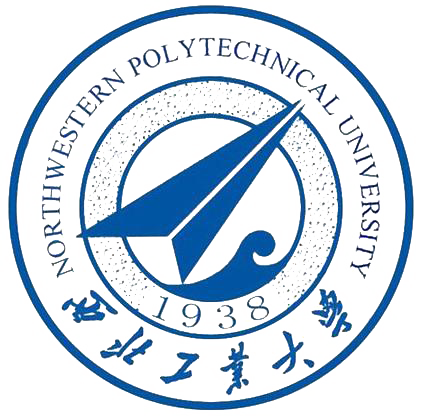
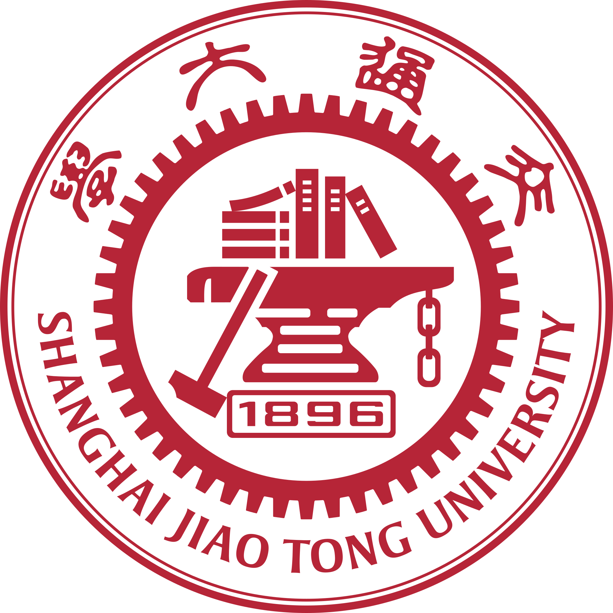

    <h1>Hi, I'm Tianyu Hao 👋</h1>
    
本科 @ <a href="https://www.nwpu.edu.cn/" target="_blank">西北工业大学</a> → 博士 @ <a href="https://www.sjtu.edu.cn/" target="_blank">上海交通大学</a> · AIGC & MLLM

    
更新于 2026.06

Latest News
======

- 📝 **[2026.06]** 一篇共同第一作者论文被 **ECCV 2026** (CCF-B) 接收：In-context Region-based Drag: Drag Any Region to Any Shape

- 🏭 **[2025.10 - 至今]** 作为项目负责人，启动面向工业缺陷检测的小样本缺陷图像生成项目。

- 🎓 **[2025.10]** 直博保研至**上海交通大学**计算机学院，同时开始在 [**BCMI 实验室**](https://bcmi.sjtu.edu.cn/){:target="_blank"} 实习。

- 🧠 **[2025.03 - 2025.06]** 完成科研训练项目：资源受限场景下的大模型微调训练技术研究与实践。

- 🥇 **[2025.02]** 在[**美国大学生数学建模竞赛**](https://www.comap.com/contests/mcm-icm){:target="_blank"}（MCM/ICM）中荣获**国际级一等奖（M奖）**。

- 🎓 **[2024.12]** 获校优秀大学生及二等奖学金。

- 🥈 **[2024.09]** 在[**全国大学生数学建模竞赛**](https://www.mcm.edu.cn/){:target="_blank"}（CUMCM）中荣获**国家级二等奖**。

- 📜 **[2024.08 - 2024.11]** 完成国家发明专利《一种用于无人机视觉语言导航任务的数据增广方法》（学生第一发明人）。

- 🎖️ **[2024.04]** 在“启智杯”机器视觉设计大赛中荣获**优秀奖**。

- 🥇 **[2023.12]** 在**第15届全国大学生数学竞赛**中荣获**省级一等奖**。

- 🎓 **[2023.12]** 获校优秀大学生及一等奖学金。

教育背景
======

  

      
      

          <strong><a href="https://www.nwpu.edu.cn/" target="_blank">西北工业大学</a></strong> 
          2022.09 - 2026.06 
          计算机科学与技术 工学学士 
          GPA: 3.918/4.1 (专业排名 8/192) | CET-6: 559
      

  

  

      
      

          <strong><a href="https://www.sjtu.edu.cn/" target="_blank">上海交通大学</a></strong> 
          2026.09 - 即将入学 
          计算机学院 博士研究生 
          研究方向：AIGC & MLLM
      

  

项目经历
======

🏭 面向工业缺陷检测的小样本缺陷图像生成

项目负责人 | 2025.10 - 至今

针对工业异常检测中缺陷样本稀缺的问题，设计并实现基于视觉基础模型与流匹配生成框架的小样本缺陷图像生成方法。将缺陷合成建模为上下文感知的局部编辑任务，构建双分支缺陷特征提取模块学习细粒度缺陷语义，基于 FLUX.1 Kontext 设计结合 inpaint-aware flow matching、缺陷特征匹配和正常区域保持约束的生成训练目标，提出 "Generate-Select-Refine" 三阶段掩码生成流程以提升缺陷区域与目标图像的对齐质量。主要负责方法设计、模型训练与实验分析。

⚡ 资源受限场景下的大模型微调训练技术研究与实践

科研训练项目 | 2025.03 - 2025.06

围绕资源受限环境下大模型微调中的显存优化问题，深入研究高效微调方法的原理与工程实现。建立 Decoder-only Transformer 显存开销评估模型，量化各类内存需求；系统调研 LoRA、QLoRA、激活值重计算与参数卸载等主流方法，从算法和系统层面分析优缺点；基于 GSM8K 数据集在 LLaMA3.2-3B 上完成 5 种微调策略对比实验，评估各方法在显存开销、训练时长与收敛质量方面的表现。

📜 国家发明专利：一种用于无人机视觉语言导航任务的数据增广方法

学生第一发明人 | 2024.08 - 2024.11

针对无人机视觉语言导航任务中数据稀缺、指令质量差及长路径下关键动作稀疏等问题，提出基于双尺度图 Transformer（DUET）和大语言模型的层次化指令生成模型。通过启发式搜索生成路径，利用 ViT-B/16 和 BERT 提取多模态特征，动态合并策略减少冗余，借助 DUET 双尺度视觉表征与 LLM 上下文推理生成高质量导航指令，经 BLEU 指标筛选形成增广数据，显著提升指令简洁性与关键动作密度。

荣誉奖项
======

<h3>🏆 奖学金</h3>
<ul>
<li>校级一等奖学金（2023）</li>
<li>校级二等奖学金（2024、2025）</li>
</ul>

<h3>🎖️ 荣誉称号</h3>
<ul>
<li>校优秀大学生（2023、2024、2025）</li>
</ul>

<h3>🥇 竞赛获奖</h3>
<ul>
<li>美国大学生数学建模竞赛 (MCM/ICM) - <strong>国际级一等奖 / M奖</strong>（2025）</li>
<li>全国大学生数学建模竞赛 (CUMCM) - <strong>国家级二等奖</strong>（2024）</li>
<li>第15届全国大学生数学竞赛 - <strong>省级一等奖</strong>（2023）</li>
<li>"启智杯"机器视觉设计大赛 - 优秀奖（2024）</li>
</ul>

